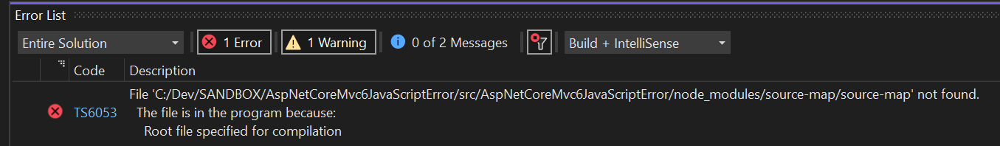

# ASP.NET Core MVC 6.0 / Visual Studio 2022 `Root file specified for compilation` error reproduction

# Steps to reproduce

1. I created an ASP.NET Core MVC 6.0 project in Visual Studio 2022. I chose .NET 6.0 and added Identity.
1. I added a `package.json` to the project and did an `npm install`.
1. After opening the project in Visual Studio and letting its background tasks finish, I get the following error in the `Error List`.

Note that I don't have any TypeScript files, but I'm getting a TypeScript error. My hunch is that something in Visual Studio is going spelunking in `node_modules` and doing something that results in this error.

# Environment

* Visual Studio 2022 17.0.2
* .NET SDK 6.0.100
* ASP.NET Core MVC 6.0
* Windows 10 Version 21H2 (OS Build 19044.1348)
* node version v16.13.1
* npm version 8.1.2